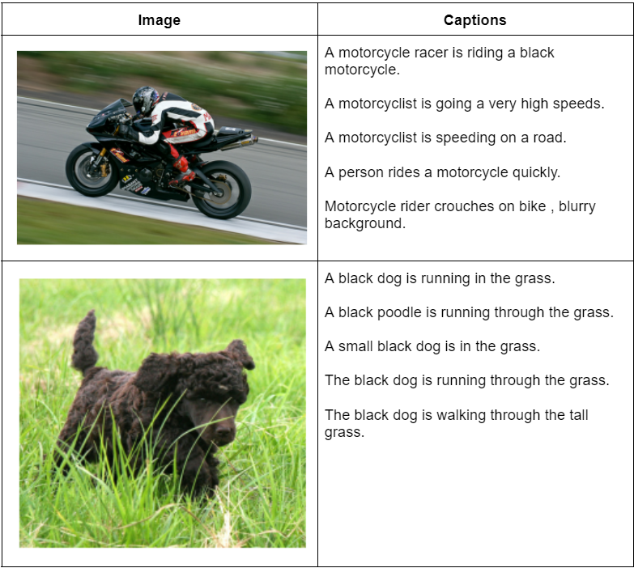

# Assignment4: Visual Image Caption Generation

## 1 - Objectives

* Building an Encoder-Decoder model for image captioning based on CNN and RNN.
* Implementing the attention mechanism and integrating it with the model.
* Learning how to deal with datasets that do not fit into RAM.
* Working with a few TensorFlow parts instead of tf.Keras.

## 2 - Flickr 8k Dataset
The Flickr dataset is used for image captioning. The dataset consists of images along with 5 captions for each image provided by human annotators.

We will be using the Flickr 8k version which consists of 8000 images and their captions.

The training set has 6000 examples.

The testing set has 1000 examples.

You can find [the dataset on Kaggle](https://www.kaggle.com/datasets/adityajn105/flickr8k), also you can find many [code notebooks](https://www.kaggle.com/datasets/adityajn105/flickr8k/code) for the dataset on Kaggle. 

To easily use the dataset on Google Colab, we will obtain it in the notebook from this [github repo](https://github.com/jbrownlee/Datasets/releases/), since the official website took it down. 

## 3 - Requirements

* Solve [this notebook](lab5.ipynb) of the assignment and deliver a filled ipython notebook that shows the best output found in your experiments. **Check the hints in the notebook to help guide you while filling in the code**.
* Any detected cheating or copying of the required code (_either from online sources or from your colleagues_) will be **severely punished**.
* Download the notebook and upload it for submission. **Make sure you include the output of each of the cells, especially the predicted caption on the test image in the evaluation section at the end. This is a clear indication that you filled the code correctly. Failing to include the outputs and the loss plots will lead to a reduction in the grades.** 
* No report is required.
