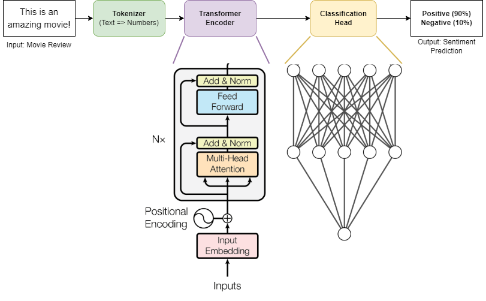

# Assignment 4: Transformer-based Sentiment Analysis

## 1 - Objectives

* Building a transformer encoder model including embedding layers, multi-headed attention, and feedforward blocks.
* Combining the transformer encoder with a tokenizer and a classification head to perform sentiment analysis.
* Handling underfitting and overfitting.
* Working with a few TensorFlow parts instead of tf.Keras.

## 2 - IMDB Dataset
The [IMDB dataset](https://www.kaggle.com/datasets/lakshmi25npathi/imdb-dataset-of-50k-movie-reviews) is used for sentiment analysis on movie reviews. The dataset consists of a movie review text and a label (0/1) indicating whether this review is negative or positive.

The training set has 25k examples.

The testing set has 25k examples.

To easily use the dataset on Google Colab, we will obtain it from the [datasets](https://pypi.org/project/datasets/) package.

## 3 - Requirements

* Solve [this notebook](lab7.ipynb) of the assignment and deliver a filled ipython notebook that shows the best output found in your experiments. **Check the hints in the notebook to help guide you while filling in the code**.
* Any detected cheating or copying of the required code (_either from online sources or from your colleagues_) will be **severely punished**.
* Download the notebook and upload it for submission. **Make sure you include the output of each of the cells, especially the loss and accuracy plots and the predicted sentiments at the end. This is a clear indication that you filled in the code correctly. Failing to include the outputs and the plots will lead to a reduction in the grades. Also, make sure you handle underfitting and overfitting.** 
* No report is required.
